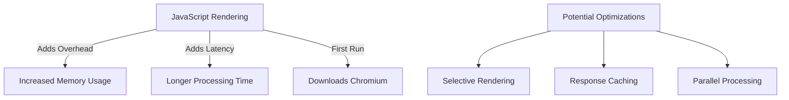
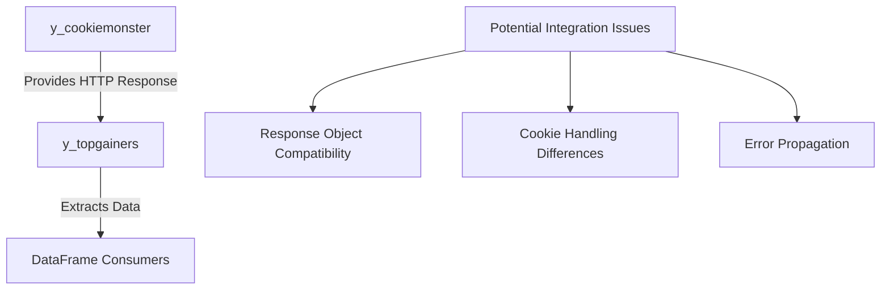

# Refactoring Architecture: BeautifulSoup to requests-html Migration

## System Components and Data Flow

```mermaid
graph TD
    subgraph "Before Refactoring"
        A1[External Request Handler] -->|HTTP Response| B1[y_topgainers.ext_get_data]
        B1 -->|HTML Text| C1[BeautifulSoup Parser]
        C1 -->|soup Object| D1[HTML Element Extraction]
        D1 -->|tr_rows| E1[Data Extraction Generator]
        E1 -->|Field Data| F1[Data Cleaning & Processing]
        F1 -->|Processed Data| G1[DataFrame Construction]
        G1 -->|tg_df0| H1[DataFrame Operations]
        H1 -->|tg_df1, tg_df2| I1[Data Presentation]
    end

    subgraph "After Refactoring"
        A2[External Request Handler] -->|HTTP Response| B2[y_topgainers.ext_get_data]
        B2 -->|Response Object| C2[requests-html Renderer]
        C2 -->|Rendered HTML| D2[CSS Selector Extraction]
        D2 -->|Element Objects| E2[Data Extraction Generator]
        E2 -->|Field Data| F2[Data Cleaning & Processing]
        F2 -->|Processed Data| G2[DataFrame Construction]
        G2 -->|tg_df0| H2[DataFrame Operations]
        H2 -->|tg_df1, tg_df2| I2[Data Presentation]
    end

    %% Key differences highlighted
    C2 -.->|Major Change: JS Rendering| Z1[Chromium Browser Instance]
    D2 -.->|API Change: find() vs find_all()| Z2[Selector Syntax Updates]
    E2 -.->|API Change: text vs stripped_strings| Z3[Text Extraction Updates]
```

## Component Descriptions

### External Request Handler
- **Current**: External system (likely y_cookiemonster) that handles HTTP requests
- **After**: Unchanged, but may need to accommodate requests-html Response objects

### ext_get_data Method
- **Current**: Processes HTTP response using BeautifulSoup
- **After**: Processes HTTP response using requests-html with JavaScript rendering

### HTML Parsing
- **Current**: BeautifulSoup creates a parse tree from HTML text
- **After**: requests-html renders JavaScript and provides access to the DOM

### Element Extraction
- **Current**: Uses BeautifulSoup's find() and find_all() methods
- **After**: Uses requests-html's find() method with CSS selectors

### Data Extraction Generator
- **Current**: Extracts text using stripped_strings iterator
- **After**: Extracts text using the text property of Element objects

### Data Cleaning & Processing
- **Current**: Complex regex and type conversion logic
- **After**: Same logic preserved, with adaptations for requests-html text extraction

### DataFrame Operations
- **Current**: Creates and manipulates multiple DataFrames
- **After**: Same operations, with updates for deprecated pandas methods

## Key Technical Differences

```mermaid
graph LR
    subgraph "BeautifulSoup API"
        BS1[soup.find('tbody')] --> BS2[tag.find_all('tr')]
        BS2 --> BS3[next(tag.stripped_strings)]
        BS3 --> BS4[tag.canvas]
    end

    subgraph "requests-html API"
        RH1[r.html.find('tbody', first=True)] --> RH2[element.find('tr')]
        RH2 --> RH3[element.text]
        RH3 --> RH4[element.find('canvas', first=True)]
    end
```

## Performance Considerations



## Integration Points



## Migration Strategy


## Risk Assessment

| Risk | Impact | Mitigation |
|------|--------|------------|
| JavaScript rendering failure | High | Fallback to non-rendered content |
| Performance degradation | Medium | Selective rendering, caching |
| Integration with y_cookiemonster | High | Coordinate changes, comprehensive testing |
| CSS selector compatibility | Medium | Thorough testing with various Yahoo Finance layouts |
| First-run experience | Low | Pre-download Chromium in deployment |